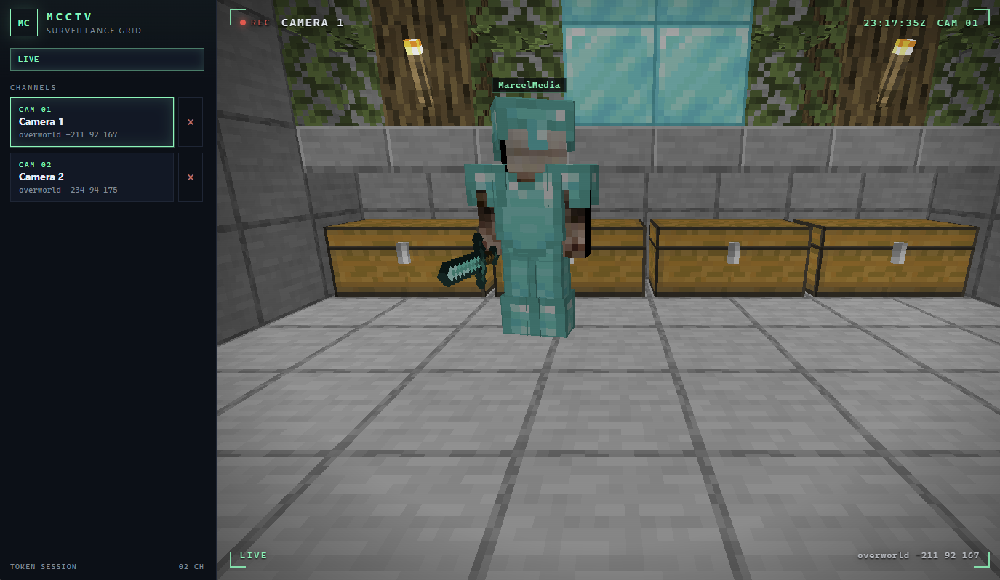
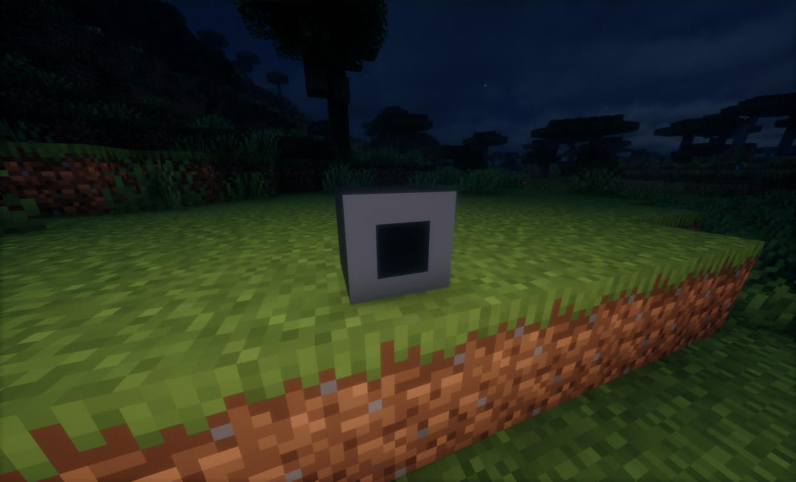

# MCCTV

A player-head on the wall. A webpage that sees what it sees.

MCCTV is a **Fabric 1.21.11** dedicated-server mod. You place cameras in the world and watch a live first-person feed from a browser. Players joining the server do not install anything.

The page is built like a cheap surveillance grid: channel list, REC, scanlines, camera name, world coordinates. Terrain, players, and held items are meshed from server state — not from a client screenshot.

---

## Screenshots


```markdown


```


---

## Requirements

| | |
| --- | --- |
| Java | 21 |
| Minecraft | 1.21.11 |
| Fabric Loader | 0.19.3 |
| Fabric API | 0.141.6+1.21.11 |

Jar + Fabric API go in the server `mods` folder. Singleplayer works via `runClient` if you want to poke at it locally.

## Setup

1. Drop the mod jar and Fabric API on the server. Boot once so `config/mcctv.json` appears.
2. Craft a CCTV Camera (iron, glass pane, redstone) or run `/cctv give`.
3. Place the head on a wall, facing the room you care about.
4. Run `/cctv` and open the clickable link. Token is in the URL; treat it like a password.
5. Walk in front of the camera. You should show up on the page.

Hard-refresh the browser (Ctrl+F5) after you update the web UI.

| Command | |
| --- | --- |
| `/cctv` | Link to your cameras |
| `/cctv name <name>` | Rename the nearest camera you own |
| `/cctv token reset` | Kill the old link |
| `/cctv give` | Give yourself a camera |
| `/cctv remove` | Remove the nearest camera you own |

Operators see every camera. Default bind is `0.0.0.0:8088`. Do not put that on the public internet without a reverse proxy and TLS. Set `publicBaseUrl` to whatever URL the browser actually uses.

## Config

`config/mcctv.json` after first boot:

| Key | Default | |
| --- | --- | --- |
| `httpPort` | `8088` | Web server port |
| `bindAddress` | `0.0.0.0` | Listen address |
| `publicBaseUrl` | `http://localhost:8088` | URL printed by `/cctv` |
| `viewDistance` | `48` | Blocks meshed around a camera |
| `maxCamerasPerPlayer` | `8` | |
| `entityHz` | `10` | How often players/mobs are sent |
| `forceLoadWhileViewing` | `true` | Keep a small radius loaded while someone is watching |
| `sendResourcePack` | `true` | Camera skin for vanilla clients |
| `ticketRadius` | `4` | Chunk ticket size while viewing |

## Build

Playable jar: `build/libs/mcctv-*.jar`. Skip the `-sources` jar.

```
gradlew.bat build          # Windows
./gradlew build            # Linux / macOS
```

`runServer` uses game port **25565** and web **8088**. One instance at a time on the same `run/` world.

GitHub Actions builds every pull request and attaches that jar as a workflow artifact. Review only — not a release.

## Contributing

Fork, patch, open a PR. Rules, test steps, and the PR checklist are in [CONTRIBUTING.md](CONTRIBUTING.md).

## License

[MIT](LICENSE)
