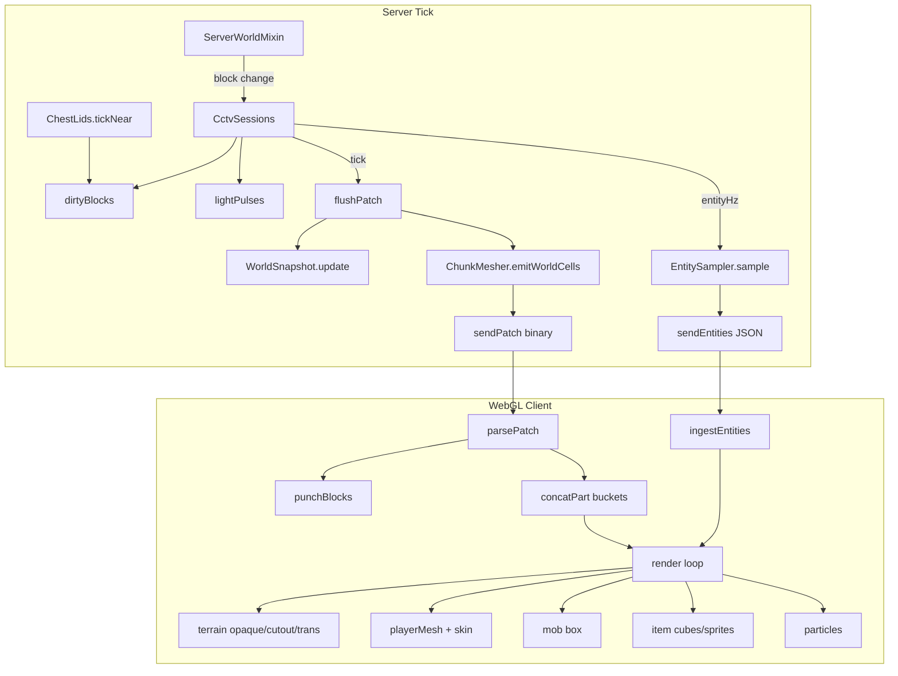

# Explore MCCTV systems
_Exported on 8/21/2026 at 23:07:04 GMT+1 from Cursor (3.14.27)_

---

**User**

Explore the MCCTV Fabric 1.21.11 project at c:\Users\User\Desktop\MCCTV thoroughly. I need a detailed map of how these systems currently work so we can implement Minecraft-parity fixes.

Return for EACH area:
- Key files + functions
- What currently happens
- What's missing vs vanilla
- Exact data currently sent to the web client (JSON field names, mesh format)

Areas:
1. Block break/place patches and mesh updates (CctvSessions sendPatch, punch, incremental vs full rebuild). Why would blocks FLASH when breaking/placing fast? Lighting updates causing flicker?
2. TNT - is primed TNT an entity? How are entities serialized?
3. Item frames, armor stands, boats, signs - any existing handling?
4. Mob/animal/player entity JSON (CctvSessions entities message). Player pose, sneaking, sitting, held items.
5. Chest lid animation (ChestLids, EntityBlockMeshes, lid property). Why jittery?
6. Beds in EntityBlockMeshes - facing/UV
7. Torches - mesh and any particles
8. Sculk sensors / calibrated sculk sensors / stonecutter - JSON models?
9. Particles (spawnBurst, torch particles)
10. How web app.js renders players, mobs, items, particles, terrain patches

Be very thorough on:
- src/main/java/com/mcctv/web/CctvSessions.java
- src/main/java/com/mcctv/mesh/* 
- src/main/resources/assets/mcctv/web/app.js
- Entity serialization

Quote relevant code snippets with file paths and line numbers. List entity types currently sent.

---

**Cursor**

Mapping MCCTV systems for Minecraft-parity fixes — starting with the core session, mesh, and web client files.


# MCCTV System Map — Minecraft Parity Reference

This maps how the Fabric 1.21.11 MCCTV mod currently works across terrain, entities, block entities, and the WebGL client.

---

## Shared Protocol Reference

### WebSocket message types

| Direction | Type | Format |
|-----------|------|--------|
| Server → client | `hello` | JSON |
| Server → client | `entities` | JSON |
| Server → client | `burst` | JSON (block break particles) |
| Server → client | `status`, `removed` | JSON |
| Server → client | Mesh | Binary `bytes[0]=1` |
| Server → client | Atlas PNG | Binary `bytes[0]=2` |
| Server → client | Patch | Binary `bytes[0]=3` |

### Full mesh binary format (`ChunkMesher.toBinary`)

```574:592:c:\Users\User\Desktop\MCCTV\src\main\java\com\mcctv\mesh\ChunkMesher.java
	private static MeshResult toBinary(WorldSnapshot snapshot, List<float[]> verts, Atlas atlas) {
		int vertexCount = verts.size();
		ByteBuffer buffer = ByteBuffer.allocate(36 + vertexCount * VERT_FLOATS * 4);
		buffer.order(ByteOrder.LITTLE_ENDIAN);
		buffer.put((byte) 'M').put((byte) 'C').put((byte) 'C').put((byte) 'T');
		buffer.putInt(2);
		buffer.putFloat(snapshot.eyeX);
		// ... eyeY, eyeZ, yaw, pitch, tiles, vertexCount, vertices
```

**Per-vertex layout (`VERT_FLOATS = 12`):**

| Index | Field | Meaning |
|-------|-------|---------|
| 0–2 | x, y, z | World position |
| 3–4 | u, v | Atlas UV (0–1 within tile) |
| 5–7 | r, g, b | Tint × light × AO |
| 8 | tile | Atlas tile index |
| 9–11 | bx, by, bz | Owning block coords (used by `punch`) |

Client parses version ≥2 as 12 floats/vert; version 1 used 9.

### Patch binary format (`sendPatch`)

```358:384:c:\Users\User\Desktop\MCCTV\src\main\java\com\mcctv\web\CctvSessions.java
	private void sendPatch(UUID cameraId, List<int[]> punch, List<float[]> verts) {
		// ...
		buffer.putInt(punch.size());
		for (int[] p : punch) {
			buffer.putInt(p[0]);
			buffer.putInt(p[1]);
			buffer.putInt(p[2]);
		}
		buffer.putInt(verts.size());
		for (float[] v : verts) {
			for (int i = 0; i < ChunkMesher.VERT_FLOATS; i++) {
				buffer.putFloat(v[i]);
			}
		}
		payload[0] = 3;
```

**Patch flow:** punch block list → remove old verts → append new verts (possibly split opaque/cutout/trans).

---

## 1. Block Break/Place Patches and Mesh Updates

### Key files + functions

| File | Role |
|------|------|
| `c:\Users\User\Desktop\MCCTV\src\main\java\com\mcctv\mixin\ServerWorldMixin.java` | Hooks `updateListeners`, `setBlockBreakingInfo` |
| `c:\Users\User\Desktop\MCCTV\src\main\java\com\mcctv\web\CctvSessions.java` | `onBlockChanged`, `flushPatch`, `sendPatch`, `rebuild` |
| `c:\Users\User\Desktop\MCCTV\src\main\java\com\mcctv\mesh\WorldSnapshot.java` | `capture`, `update`, `lightMatches` |
| `c:\Users\User\Desktop\MCCTV\src\main\java\com\mcctv\mesh\ChunkMesher.java` | `build`, `emitWorldCells`, `emitCell` |
| `c:\Users\User\Desktop\MCCTV\src\main\resources\assets\mcctv\web\app.js` | `parsePatch`, `punchBlocks`, `punchPart` |

### What currently happens

**Trigger chain:**

```116:147:c:\Users\User\Desktop\MCCTV\src\main\java\com\mcctv\web\CctvSessions.java
	public void onBlockChanged(World world, BlockPos pos, BlockState oldState, BlockState newState) {
		// ...
		this.dirtyBlocks.computeIfAbsent(cameraId, ...).add(pos.toImmutable());
		int emit = Math.max(luminance(oldState), luminance(newState));
		if (emit > 0) {
			this.lightPulses.computeIfAbsent(cameraId, ...).merge(pos.toImmutable(), emit, Math::max);
		}
		if (broke && world instanceof ServerWorld serverWorld) {
			this.sendBurst(cameraId, serverWorld, pos, oldState);
		}
```

**Each server tick:**

```160:174:c:\Users\User\Desktop\MCCTV\src\main\java\com\mcctv\web\CctvSessions.java
	public void tick() {
		// ...
		for (UUID cameraId : Set.copyOf(this.dirtyBlocks.keySet())) {
			this.flushPatch(cameraId, false);   // geometry pass
		}
		for (UUID cameraId : Set.copyOf(this.relightAt.keySet())) {
			if (due != null && this.tick >= due) {
				this.flushPatch(cameraId, true); // relight pass
			}
		}
```

**`flushPatch` logic:**

1. Expand each dirty block to itself + 6 neighbors.
2. On relight pass: BFS from `lightPulses` origins (radius up to 15) for blocks where snapshot light ≠ world light.
3. If expanded set > 900 → **full rebuild** instead of patch.
4. Update snapshot voxels, mesh on single-thread `meshExecutor`, send patch.
5. Schedule relight: first pass sets `relightAt = tick + 4`; optional second pass at `tick + 8`.

**Client side:**

```538:607:c:\Users\User\Desktop\MCCTV\src\main\resources\assets\mcctv\web\app.js
function punchBlocks(blocks) {
	// removes ALL triangles whose bx,by,bz match punch coords
	// then concatPart adds new geometry bucketed opaque/cutout/trans
}
```

**Incremental vs full rebuild:**

| Condition | Action |
|-----------|--------|
| Viewer connects | Full `rebuild()` |
| Patch > 900 cells | Full `rebuild()` |
| No snapshot/atlas/book | Full `rebuild()` |
| Atlas not frozen yet | Re-queue dirty, defer patch |
| Normal block change | Incremental patch |

### What's missing vs vanilla

- No chunk-section meshing; per-block cell emit only.
- No smooth lighting propagation in snapshot — sampled at mesh time from stored block/sky levels.
- No block break/place sounds or animations (except crack overlay + break burst).
- No piston extension, fluid flow tick updates unless they fire `updateListeners`.
- Neighbor faces re-emitted on every change but lighting is **two-pass delayed**.

### Why blocks FLASH when breaking/placing fast

**Yes — lighting updates are a primary flicker cause**, plus geometry timing:

1. **Punch-before-append gap:** `punchBlocks` runs immediately; new verts arrive after async mesh. During that window, punched cells are invisible (flash to sky/fog).

2. **Dual-pass relight (4–8 tick delay):**

```282:291:c:\Users\User\Desktop\MCCTV\src\main\java\com\mcctv\web\CctvSessions.java
		if (!relight) {
			this.relightBlocks...addAll(expanded);
			this.relightAt.put(cameraId, this.tick + 4);
		} else if (this.relightPass.getOrDefault(cameraId, 0) < 1 && (hasPulse || expanded.size() > 12)) {
			this.relightAt.put(cameraId, this.tick + 8);
```

   First patch uses snapshot light captured at `update()` time; relight patch 4 ticks later changes brightness on same geometry → visible flash, especially torches/glowstone.

3. **`lightPulses`:** Breaking/placing luminous blocks expands relight to radius `min(15, luminance)` — large secondary patches.

4. **Single mesh thread:** Rapid changes queue; each flush punches again before prior verts visible.

5. **Neighbor expansion:** 1 changed block → 7 cells punched/rebuilt; fast placement multiplies work and punch area.

6. **>900 threshold:** Burst of changes triggers full mesh reset (atlas + all verts) — hard flash.

---

## 2. TNT

### Is primed TNT an entity?

**Yes.** `TntEntity` is a non-living entity. It is **not sampled** — `EntitySampler` only queries `LivingEntity` and `ItemEntity`.

### How entities are serialized

Only via `EntitySampler.sample()` → JSON `entities` message. No other entity serialization path exists.

**Entity types currently sent:**

| Array | Java query | Rendered as |
|-------|-----------|-------------|
| `players` | `PlayerEntity` (subset of LivingEntity) | Full skin model |
| `mobs` | All other `LivingEntity` | Orange 0.5×1.4×0.5 box |
| `items` | `ItemEntity` | Textured cube or extruded sprite |

**Included in `mobs` (LivingEntity):** zombies, animals, villagers, **armor stands**, illagers, etc. — anything extending `LivingEntity`.

**NOT sent:** TNT, boats, minecarts, item frames, paintings, arrows, experience orbs, falling blocks, end crystals, etc.

---

## 3. Item Frames, Armor Stands, Boats, Signs

| Entity/Block | Server handling | Client rendering |
|--------------|-----------------|------------------|
| **Armor stand** | Sampled as `LivingEntity` → `mobs[]` with `type` = translation key | Generic orange box |
| **Item frame** | Not sampled | Nothing |
| **Boat** | Not sampled (`Entity`, not `LivingEntity`) | Nothing |
| **Signs** | Block mesh via `BlockModels.bake()` if JSON model exists | Terrain atlas |
| **Hanging sign** | Same block pipeline | Terrain atlas |

No dedicated code for frame contents, boat pose, or sign text.

---

## 4. Mob/Animal/Player Entity JSON

### Key file: `EntitySampler.java`

```36:97:c:\Users\User\Desktop\MCCTV\src\main\java\com\mcctv\entity\EntitySampler.java
	public static JsonObject sample(ServerWorld world, CameraRecord camera, CctvConfig config) {
		// ...
		root.addProperty("type", "entities");
		root.add("players", players);
		root.add("mobs", mobs);
		root.add("items", sampleItems(...));
		root.addProperty("count", entities.size());
		SkyAppearance.capture(...).writeJson(root);
```

### Root `entities` message fields

| Field | Type | Notes |
|-------|------|-------|
| `type` | `"entities"` | |
| `players` | array | |
| `mobs` | array | |
| `items` | array | |
| `count` | int | LivingEntity count only |
| `breaking` | array | Added by `CctvSessions.sendEntities` |
| Sky fields | float | From `SkyAppearance.writeJson` |

### Per-player fields

| Field | Source |
|-------|--------|
| `x,y,z` | position |
| `yaw,pitch,bodyYaw` | rotation |
| `sneaking` | `isInSneakingPose()` |
| `pose` | `getPose().asString()` — e.g. `standing`, `crouching`, `sleeping`, `swimming`, `fall_flying`, `spin_attack`, `dying` |
| `limb`, `limbAmount` | limb animator |
| `swing`, `swinging`, `swingLeft` | hand swing |
| `vx,vz,speed` | derived from position delta × `entityHz` |
| `uuid`, `name` | |
| `slim` | **UUID hash bit** (not skin metadata) |
| `leftMain` | main arm |
| `mainHand`, `offHand` | stack JSON |
| `armor` | `{head,chest,legs,feet}` material strings |

### Per-mob fields

Same motion/pose fields as players **except** no uuid/hand/armor. Adds:

| Field | Value |
|-------|-------|
| `type` | `entity.getType().getTranslationKey()` e.g. `entity.minecraft.zombie` |
| `name` | display name |

### Hand/stack JSON (`stackJson`)

```136:161:c:\Users\User\Desktop\MCCTV\src\main\java\com\mcctv\entity\EntitySampler.java
		json.addProperty("block", blockId);   // path only, e.g. "stone"
		json.addProperty("cube", cube);       // full-cube BlockItem
		json.addProperty("item", itemId);    // path only
		json.addProperty("color", color);    // map color int
		// tile added server-side if atlas frozen
```

### Per-item-entity fields

Merges stack fields plus: `uuid`, `x,y,z`, `age`, `uniqueOffset`, `name`.

### `breaking` array (per block being mined)

```json
{ "x": int, "y": int, "z": int, "stage": 0-9 }
```

### What's missing vs vanilla

- **Sitting/riding:** `pose` sent but client ignores `sitting`, `sleeping`, vehicle mount offset.
- **Player slim model:** guessed from UUID, not skin.
- **Mob models:** no per-entity geometry/textures.
- **Equipment on mobs:** not serialized.
- **Head rotation decoupled from body** on mobs: sent but mobs rendered as boxes.
- **Invisibility/glowing** not represented visually (filtered server-side for invisible).
- **Frustum culling:** crude dot-product cone (`> 0.15`), not raycast occlusion.

### Client pose handling (`playerPose`)

```951:976:c:\Users\User\Desktop\MCCTV\src\main\resources\assets\mcctv\web\app.js
	const sneak = p.sneaking || p.pose === "crouching";
	const bodyPitch = sneak ? 0.5 : (p.pose === "swimming" || p.pose === "fall_flying" ? 1.4 : 0);
```

Handles: sneaking/crouching, swimming, elytra. **No** sitting, sleeping, spin_attack, dying poses.

---

## 5. Chest Lid Animation

### Key files

| File | Role |
|------|------|
| `ChestLids.java` | Tracks open progress 0–10 per chest |
| `WorldSnapshot.read()` | Injects `lid=N` into block props |
| `EntityBlockMeshes.chest()` | Rotates lid cuboid by `lidPitch(props)` |
| `CctvSessions.tickChests()` | Marks chests dirty every tick while animating |

### What happens

```73:88:c:\Users\User\Desktop\MCCTV\src\main\java\com\mcctv\mesh\ChestLids.java
	private static boolean step(...) {
		boolean open = isViewed(world, be);
		int next = open ? Math.min(10, cur + 1) : Math.max(0, cur - 1);
		// CHANGED → add to dirty list every tick progress changes
```

```193:196:c:\Users\User\Desktop\MCCTV\src\main\java\com\mcctv\mesh\WorldSnapshot.java
		if (ChestLids.tracks(id)) {
			String lid = "lid=" + ChestLids.progress(world, pos);
			props = props.isEmpty() ? lid : props + "," + lid;
```

```79:89:c:\Users\User\Desktop\MCCTV\src\main\java\com\mcctv\mesh\EntityBlockMeshes.java
	private static float lidPitch(Map<String, String> props) {
		p = Float.parseFloat(props.getOrDefault("lid", "0")) / 10f;
		g = 1f - p;
		g = 1f - g * g * g;  // ease-out cubic
		return -g * (PI/2);
```

Lid is a separate cuboid rotated around Y=9, Z=1 pivot (approximate vanilla chest lid hinge).

### What's missing vs vanilla

- Vanilla uses interpolated `getAnimationProgress()` per frame; MCCTV steps **±1 per tick** (0–10 discrete).
- Double chest partner lid sync not explicit (each half tracked separately via `LidOpenable`).
- No barrel/shulker lid variants in `ChestLids.tracks()` — only id contains `"chest"`.
- Sound/particles on open: none.

### Why jittery

1. **Discrete 10-step animation** re-meshed each step via full block patch (punch + rebuild lid cuboid).
2. **Every progress tick marks dirty** → patch every game tick while opening/closing.
3. **Patch async delay:** lid geometry lags 0–1 frames behind punch.
4. **Relight pass** 4 ticks later may re-patch same chest with different lighting.
5. **No client-side interpolation** of lid angle between server updates.

---

## 6. Beds in EntityBlockMeshes

### Key file: `EntityBlockMeshes.bed()`

Beds use **entity bed texture atlases** (`entity_bed_<color>`) with hardcoded UV crops — not JSON block models.

```25:54:c:\Users\User\Desktop\MCCTV\src\main\java\com\mcctv\mesh\EntityBlockMeshes.java
	private static List<BlockModels.BakedQuad> bed(String id, Map<String, String> props, int extraY) {
		String color = id.substring(0, id.length() - 4);  // "red_bed" → "red"
		boolean head = "head".equals(props.get("part"));
		int y = yaw(extraY, props.get("facing"), true);
```

**Facing rotation (bed mode):**

```177:194:c:\Users\User\Desktop\MCCTV\src\main\java\com\mcctv\mesh\EntityBlockMeshes.java
		if (bed) {
			return switch (facing) {
				case "east" -> 90;
				case "south" -> 180;
				case "west" -> 270;
				default -> 0;  // north
			};
		}
```

Head vs foot use different UV regions on the 64×64 bed entity texture. Leg posts added as 3×3×3 cuboids at corners.

**Triggered when:** `BlockModels.bake()` finds empty model elements for bed blockstate variant → falls through to `EntityBlockMeshes.quads()`.

### Missing vs vanilla

- Occupied bed (player sleeping) not special-cased.
- `part`/`facing` must match blockstate props exactly — if variant scoring fails, wrong half orientation.
- No bed sheet color from block entity NBT (uses block id color only).
- UV crops are static; no resolution-independent entity renderer.

---

## 7. Torches

### Mesh

Torches bypass JSON models:

```164:169:c:\Users\User\Desktop\MCCTV\src\main\java\com\mcctv\mesh\ChunkMesher.java
		if (voxel.torch()) {
			BlockAppearance.Face face = new BlockAppearance.Face(BlockAppearance.torchTexture(voxel.id()), ...);
			emitTorch(verts, ..., voxel.facing(), tile, light);
```

`emitTorch` builds a small axis-aligned box (7/16–9/16 cross-section, height 10/16) oriented by `facing` for wall torches.

Texture selection:

```32:44:c:\Users\User\Desktop\MCCTV\src\main\java\com\mcctv\mesh\BlockAppearance.java
	public static boolean isTorch(String id) {
		return id.equals("torch") || id.equals("soul_torch") || id.equals("redstone_torch")
				|| id.equals("wall_torch") || ...
```

### Particles

**No torch flame/smoke particles.** Server never emits ambient torch particles.

Only particle path: **block break burst** (`sendBurst` on break) and client-side `spawnBurst`.

Break burst uses block's `particle` texture from JSON model:

```37:48:c:\Users\User\Desktop\MCCTV\src\main\java\com\mcctv\mesh\BlockModels.java
	public static String particleTexture(String id) {
		String ref = model.textures.get("particle");
```

---

## 8. Sculk Sensors / Calibrated Sculk / Stonecutter

### Handling

These are **standard JSON block models** baked by `BlockModels`:

- Vanilla assets shipped under `assets/mcctv/vanilla/{blockstates,models}/`
- `BlockModels.ensureLoaded()` loads index files at startup
- `bake(id, props)` resolves variants/multipart → element quads

**Sculk sensor** blockstates switch models by `sculk_sensor_phase=active|cooldown|inactive`.

**Calibrated sculk** adds `facing=` variants with Y-rotation in blockstate JSON.

**Stonecutter** has `facing` variants with model rotation; model includes saw element with `"rotation"` in elements.

### Missing vs vanilla

- Sculk sensor **tendril animation** (active tendrils) is static per phase — no tick interpolation.
- Sculk shrieker/can_summon state: model swap only, no shriek particles.
- Stonecutter: saw rotation not animated.
- Sculk vein multipart connections: handled if blockstate `when` matches; no emission glow pulse.
- Block entity render data (sensor cooldown ring, calibrated amethyst glow timing) not used.

If model JSON missing from index, block falls back to **cube faces** via `BlockAppearance.face()` (wrong for complex blocks).

---

## 9. Particles

### Server

Only **`sendBurst`** on block break:

```332:355:c:\Users\User\Desktop\MCCTV\src\main\java\com\mcctv\web\CctvSessions.java
		json.addProperty("type", "burst");
		json.addProperty("x", "y", "z", tile, r, g, b);
```

### Client `spawnBurst`

```610:644:c:\Users\User\Desktop\MCCTV\src\main\resources\assets\mcctv\web\app.js
	// 4×4×4 = 64 particles per break
	particles.push({ x,y,z, vx,vy,vz, life, age, floor, size, tile, u0,v0,u1,v1, cr,cg,cb });
```

`tickParticles`: gravity, drag, floor bounce. Rendered as camera-facing quads in `drawParticle`.

### Missing vs vanilla

- No torch/smoke/fire/water/lava/portals/redstone dust particles.
- No entity attack crit particles, footsteps, splash, etc.
- Break burst count/velocity differs from vanilla block-break particles.
- Particles use terrain atlas tile, not dedicated particle atlas (uses random 4×4 sub-rect of tile).

---

## 10. Web App Rendering (`app.js`)

### Terrain

1. `parseMesh` → `refreshTerrain` → `classifyTiles` (opaque/cutout/trans by alpha) → `splitTerrain`
2. Draw order: sky dome → opaque → cutout (alpha test) → transparent (blend)
3. Patches: punch by `bx,by,bz` then concat new verts into buckets

### Players

- `ingestEntities` → interpolation buffer `poses` Map
- `tickPoses` smooths position/yaw/pitch/bodyYaw, local swing animation
- `playerMesh` builds Steve/Alex boxes from skin UV layout
- `ensureSkin` fetches `/api/skin/<uuid>` (fallback Crafatar)
- Armor layers from `/api/armor/<layer>/<material>.png`
- Held items: block cubes use atlas `tile`; items use extruded PNG mesh

### Mobs

```1343:1347:c:\Users\User\Desktop\MCCTV\src\main\resources\assets\mcctv\web\app.js
	for (const m of sampled.mobs) {
		drawBox(mobData, m.x - 0.25, m.y, m.z - 0.25, 0.5, 1.4, 0.5, 0.85, 0.4, 0.25);
	}
```

Single orange box; **`m.type` ignored**.

### Items (ground)

- Bob + spin from `age` and `uniqueOffset`
- Block items: `drawTexturedCube` with `tile`
- Other items: `drawItemSprite` billboard

### Particles

Camera-aligned quads, terrain atlas, fog via vertex shader.

### Breaking overlay

`drawCrackCube` — fullscreen block overlay using `/api/destroy.png` 4×4 stage tiles, blend mode `DST_COLOR, SRC_COLOR`.

### Nametags

HTML overlay projected via `projectPoint`; height offset 1.55 (sneak) / 2.15 (stand).

---

## Architecture Diagram



---

## Priority Parity Gaps (Summary)

| Area | Biggest gaps |
|------|-------------|
| Patches | Dual-pass relight flash; punch-before-append hole; no merge/coalesce of dirty sets |
| Entities | TNT, boats, item frames, projectiles absent; mobs are boxes |
| Chest lids | Discrete 10-step + per-tick remesh; no interpolation |
| Beds | Hardcoded entity UVs; facing via custom yaw table |
| Torches | No ambient flame particles |
| Particles | Break-only bursts |
| Players | Sitting/sleeping/riding poses ignored; slim from UUID hash |

All entity serialization lives in a single file: `c:\Users\User\Desktop\MCCTV\src\main\java\com\mcctv\entity\EntitySampler.java`. There is no separate entity mesh pipeline on the server.

